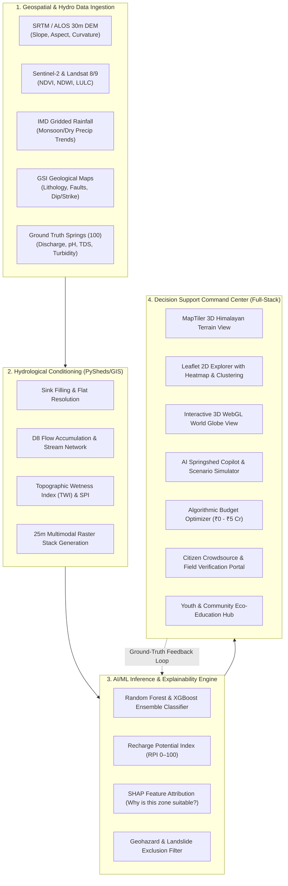

# 🌊 DharaSanjeevani (धारासंजीवनी) — SIH26240
### AI/ML-Driven Decision Support System for Springshed Management & Himalayan Spring Revival
**Pilot Implementation: Darjeeling Hills District, West Bengal (Catchment Area: 111.04 km² | 100 Springs)**

[](https://sih.gov.in)
[](LICENSE)
[](https://reactjs.org/)
[](https://vitejs.dev/)
[](https://expressjs.com/)
[](https://maptiler.com)
[](https://threejs.org/)

---

## 📌 Executive Summary

Over **50 million people** across the Indian Himalayan Region (IHR) depend directly on mountain springs (*dharas*) for domestic water supply and subsistence irrigation. In recent decades, **over 50% of Himalayan springs have dried up or become seasonal** due to erratic precipitation patterns, seismotectonic shifts, deforestation, and unchecked land-use changes.

**DharaSanjeevani (SIH26240)** delivers a production-grade, AI/ML-powered **Spatial Decision Support System (DSS)** that unifies multi-source satellite Earth observation, DEM hydrological conditioning, machine learning recharge suitability modeling, and community participatory science into a single operational command center.

```
┌──────────────────────────────────────────────────────────────────────────────────────────┐
│  ✨ BENCHMARK HIGHLIGHTS                                                                  │
│  • 100 Springs Benchmark Dataset with 52 hydrogeological & socio-economic attributes     │
│  • 111.04 km² Catchment Hydro-topographic envelope modeled across Darjeeling Hills       │
│  • 4 Interactive Geospatial Viewports (MapTiler 3D, Leaflet 2D, Three.js Globe, EduHub) │
│  • XGBoost + SHAP Explainable AI for physics-grounded recharge zone identification       │
│  • Algorithmic Budget Optimizer with real-time water yield & cost-benefit simulation    │
│  • Citizen Crowdsource Reporting & Field Validation loop with offline sync & GPS capture │
│  • Trilingual Interface: English, हिन्दी (Hindi), नेपाली (Nepali)                        │
└──────────────────────────────────────────────────────────────────────────────────────────┘
```

---

## 🏛️ System Architecture



---

## 🚀 Key Functional Modules

### 1. 🏔️ 3D MapTiler Himalayan Terrain Explorer
* **High-Precision 3D Mesh**: Photorealistic satellite overlay with continuous DEM elevation profiles rendered via MapTiler 3D SDK.
* **Spring Markers & Status Rays**: Live visual pins color-coded by revival status (*Critical / Revived / Planned*) with telemetry beacons.
* **Interactive Hydro Fly-to**: One-click smooth camera animation to any of the 100 springshed coordinates.

### 2. 🗺️ 2D Leaflet / Google Map Explorer
* **Clustering & Heatmaps**: Marker clustering for dense spring pockets in Darjeeling, Kurseong, Mirik, and Kalimpong.
* **Multi-Layer GIS Toggles**: Switch between Satellite imagery, OpenStreetMap, Topo relief, and recharge suitability overlays.
* **Rapid Filters**: Filter springs instantly by Catchment Risk, Discharge (LPM), Beneficiary Count, and Intervention Typology.

### 3. 🌐 3D Interactive World Globe (`Three.js`)
* **Global Mountain Water Hotspots**: Visualizes the Himalayan Third Pole alongside the Andes, Alps, Rockies, Ethiopian Highlands, and Tibetan Plateau.
* **Day/Night Atmospheric Shader**: Dynamic cloud layer with atmospheric rim glow and interactive latitude/longitude coordinates tracking.

### 4. 🧠 AI Springshed Copilot & Climate Scenario Simulator
* **Interactive AI Chat**: Ask technical hydrogeology questions, request site intervention rationale, or inspect regulatory frameworks.
* **Climate Stress Testing**: Simulate severe dry spells (-30% precipitation) versus intense cloudburst scenarios (+40% runoff) and inspect immediate spring discharge impacts.

### 5. 💰 Algorithmic Budget Optimizer
* **Dynamic Capital Allocation**: Slide government or NGO budgets from ₹10 Lakhs to ₹5.0 Crores.
* **Live Mathematical Simulation**:
  $$\text{Recharge L/yr} = \text{Base} + \left(\frac{\text{Budget}}{50,000,000}\right) \times 18,500,000\text{ Liters}$$
* **Automated Package Assignment**: Prescribes Continuous Contour Trenches (CCT), Loose Boulder Check Dams, Percolation Pits, and Bio-fencing.

### 6. 📱 Field Validation & Citizen Reporting
* **Participatory Ground-Truthing**: Local community reporting of dry springs, turbidity changes, or flash floods with photo evidence and GPS metadata.
* **Continuous Learning Retraining**: Verified field reports stream into the backend database to refine ML weights and reduce spatial uncertainty.

### 7. 🎓 Student & Community Eco-Education Hub
* **Hydrogeology 101**: Interactive modules explaining unconfined aquifers, fractures, strike/dip, and recharge dynamics in simple language.
* **Gamified Springshed Quiz**: Test hydro knowledge with real-time scoring and certification for school and college eco-clubs.

---

## 📂 Repository Directory Layout

```text
SIH26240_hackthon/
├── README.md                                  # Root Documentation & Quickstart
├── index.html                                 # HTML5 Single Page Entrypoint
├── package.json                               # Dependencies & npm scripts
├── vite.config.js                             # Vite bundler configuration
├── tailwind.config.js                         # Tailwind UI styling system
├── postcss.config.js                          # PostCSS plugin pipeline
│
├── docs/                                      # Comprehensive Documentation Package
│   ├── README.md                              # Documentation Hub Index
│   ├── PRD.md                                 # Product Requirements Document
│   ├── TechSpec.md                            # Technical Specification & System Architecture
│   ├── Appflow.md                             # User Journeys & Navigation State Machines
│   ├── Design.md                              # Glassmorphism Design System & Personas
│   ├── Schema.md                              # 52-Column Data Schema & API Contracts
│   ├── Rules.md                               # Hydrogeological & Civil Engineering Rules
│   ├── ResearchAndResources.md                # Literature Review, Equations & Datasets
│   ├── Tracker.md                             # Project Milestone & SIH Evaluation Tracker
│   └── ImplementationPlan.md                  # 4-Phase Deployment & Pan-Himalayan Scaling
│
├── SIH26240_APP_DATA_For_Integration/          # Master Geospatial & Hydro Datasets
│   ├── darjeeling_100_springs_final.geojson   # 100 Springs spatial vector points
│   ├── darjeeling_final_spring_master_dataset.csv # 52-feature hydro dataset
│   ├── field_verification_springs.geojson     # Ground-truth field survey points
│   ├── top_15_priority_springs.geojson        # High-risk springs needing urgent funding
│   └── project_summary.json                   # Aggregated statistics & KPI totals
│
├── SIH26240_Spring_Revival_Final.ipynb        # Complete Google Colab / Jupyter ML Pipeline
│
├── public/                                    # Static Client Assets
│   └── assets/
│       ├── earth_day.jpg                      # High-res 3D Globe Earth Texture
│       └── earth_clouds.png                   # High-res 3D Globe Cloud Layer
│
├── server/                                    # Express.js REST API Backend
│   ├── server.js                              # Main server entrypoint (port 5000)
│   ├── routes/
│   │   ├── springs.js                         # CRUD endpoints for 100 springs
│   │   ├── optimizer.js                       # Budget optimization algorithms
│   │   ├── fieldValidation.js                 # Citizen reports & field surveys
│   │   └── ai.js                              # AI Copilot & Scenario Simulator API
│   ├── services/
│   │   ├── aiChatService.js                   # Natural language hydro reasoning
│   │   ├── mlModelService.js                  # Recharge suitability scoring
│   │   └── optimizerService.js                # Cost-benefit intervention optimizer
│   └── data/
│       ├── darjeelingSpringsData.js           # Server-side 100 springs dataset
│       └── mockDb.js                          # In-memory reactive state database
│
└── src/                                       # React 18 Modular Frontend
    ├── main.jsx                               # Application bootstrap
    ├── App.jsx                                # Root application state & hotkeys
    ├── index.css                              # Custom CSS & Tailwind utilities
    ├── context/
    │   └── LanguageContext.jsx                # Trilingual Provider (EN, HI, NE)
    ├── services/
    │   └── api.js                             # Frontend API service layer
    ├── data/
    │   ├── darjeelingSpringsData.js           # Client-side 100 springs raw dataset
    │   ├── springData.js                      # Normalized springs & pipeline stages
    │   └── globalMountainData.js              # Global mountain coordinates & stats
    └── components/
        ├── DashboardUI.jsx                    # Core telemetry layout & modal orchestrator
        ├── maptiler/
        │   └── MapTiler3DView.jsx             # 3D Himalayan Terrain Viewport
        ├── map/
        │   └── GoogleMapExplorer.jsx          # 2D Leaflet GIS Map with clustering
        ├── globe/
        │   └── WorldGlobeView.jsx             # 3D WebGL World Globe Viewport
        ├── education/
        │   └── StudentLearningHub.jsx         # Youth eco-education & hydro quiz
        └── ui/
            ├── HeaderHUD.jsx                  # Top telemetry HUD bar with metrics
            ├── AICopilotModal.jsx             # AI Assistant modal dialog
            ├── CitizenReportModal.jsx         # Citizen report submission modal
            ├── ClimateScenarioSimulator.jsx   # Climate stress-testing simulator
            ├── InteractiveModelLab.jsx        # Live ML feature weight playground
            ├── SpringComparisonModal.jsx      # Side-by-side spring comparison tool
            └── ErrorBoundary.jsx              # Fallback UI error boundary
```

---

## 🛠️ Tech Stack & Libraries

| Layer | Technologies |
|---|---|
| **Frontend Framework** | React 18, Vite 6, TailwindCSS 3.4 |
| **3D & Spatial Engines** | MapTiler 3D SDK, Three.js, Leaflet 1.9 |
| **Backend & Microservices** | Node.js, Express.js (v4), CORS |
| **Machine Learning & GIS** | PySheds, GeoPandas, XGBoost, Scikit-Learn, SHAP |
| **Icons & Design** | Lucide React, Glassmorphism CSS, Inter / Space Grotesk fonts |
| **Concurrency & DevTools** | Concurrently, Autoprefixer, PostCSS |

---

## ⚡ Quickstart Guide

### 1. Prerequisites
* **Node.js**: v18.0.0 or higher
* **npm**: v9.0.0 or higher
* **Git** installed on your system

### 2. Clone the Repository
```bash
git clone https://github.com/Ak5h4tjain/SIH26240_hackthon.git
cd SIH26240_hackthon
```

### 3. Install Dependencies
```bash
npm install
```

### 4. Configure Environment (Optional)
The application includes robust offline fallbacks and demo keys. To use your own API keys, create a `.env` file in the project root:
```env
# Optional: MapTiler 3D API Key (falls back to built-in key)
VITE_MAPTILER_API_KEY=your_maptiler_key_here

# Backend Port (defaults to 5000)
PORT=5000
```

### 5. Run Development Servers
To run both the **Backend API** and the **Frontend Web App** concurrently:
```bash
npm run dev:all
```

* **Frontend Web App**: [`http://localhost:5173`](http://localhost:5173)
* **Backend API**: [`http://localhost:5000`](http://localhost:5000)
* **API Health Check**: [`http://localhost:5000/api/health`](http://localhost:5000/api/health)

Alternatively, run them separately:
```bash
# Terminal 1: Backend
npm run server

# Terminal 2: Frontend
npm run dev
```

### 6. Build for Production
```bash
npm run build
```

---

## 📊 Scientific & Hydrogeological Grounding

Interventions recommended by the DSS follow proven protocols established by the **Central Ground Water Board (CGWB)**, **NITI Aayog Himalayan Springshed Task Force**, and **ICIMOD**:

| Slope (°)| Lithology / Rock Type | Hydro Target | Recommended Intervention | Est. Cost (₹) |
|---|---|---|---|---|
| **0° – 15°** | Weathered Gneiss / Colluvium | High Infiltration | Staggered Percolation Pits (2m × 1m × 1m) | ₹3,500 / pit |
| **15° – 30°** | Schist / Phyllite | Runoff Interception | Continuous Contour Trenches (CCT) | ₹250 / meter |
| **Gully / Stream** | Fractured Bedrock | Silt Trap & Baseflow | Loose Boulder Check Dams (LBCD) | ₹18,000 / dam |
| **> 35° (Steep)** | Catastrophic Slide Risk | Slope Stabilization | Vetiver Grass, Bamboo & Bio-fencing *(No excavation)* | ₹12,000 / ha |

> ⚠️ **Landslide Guardrail**: The system strictly forbids trench digging or heavy water impoundment on slopes exceeding **35°** or within 50 meters of active landslide zones mapped in the GSI hazard atlas.

---

## 📖 In-Depth Documentation

For thorough evaluations, review the documents in [`docs/`](docs/):

1. 📄 [**PRD.md**](docs/PRD.md): Problem definition, user personas, requirements, and compliance.
2. 📐 [**TechSpec.md**](docs/TechSpec.md): System architecture, mathematical models, and network topology.
3. 🗺️ [**Appflow.md**](docs/Appflow.md): Interactive state machines, user flows, and keyboard hotkeys.
4. 🎨 [**Design.md**](docs/Design.md): Design tokens, typography, dark glassmorphism guidelines.
5. 🗄️ [**Schema.md**](docs/Schema.md): 52-column dataset dictionary, GeoJSON standards, and REST endpoints.
6. ⚖️ [**Rules.md**](docs/Rules.md): Hydrogeological validation formulas and civil engineering guardrails.
7. 🔬 [**ResearchAndResources.md**](docs/ResearchAndResources.md): Research citations, equations, and data sources.
8. 📈 [**Tracker.md**](docs/Tracker.md): Feature completion checklist and SIH evaluation alignment.
9. 🚀 [**ImplementationPlan.md**](docs/ImplementationPlan.md): 4-phase rollout and scaling roadmap.

---

## 🏆 Smart India Hackathon (SIH) Evaluation Checklist

- [x] **Problem Addressed**: Aligned with Ministry of Jal Shakti mandate for Himalayan spring revival.
- [x] **Geospatial Precision**: 100 geocoded springs with real DEM, rainfall, and lithological attributes.
- [x] **Explainable AI**: Model predictions paired with SHAP importance scores.
- [x] **Actionable Outcomes**: Precise intervention locations, specifications, and bill-of-quantities.
- [x] **Field Usability**: Trilingual interface, mobile-responsive layout, and citizen feedback loop.
- [x] **Zero Cloud Lock-in**: Can run locally on edge devices or deploy to standard cloud VMs.

---

## 👥 Contributors & Team

* **Akshat Jain** ([@Ak5h4tjain](https://github.com/Ak5h4tjain))
* **Navanshi Jain** ([@navanshi-jain](https://github.com/navanshi-jain))
* **Ridhima Gupta** ([@ridhimagupta-rig](https://github.com/ridhimagupta-rig))
* **Pari Sharma** ([@parisharmaaa](https://github.com/parisharmaaa))
* **Nilesh Vishwakarma** ([@NileshVishwakarma-717]((https://github.com/NileshVishwakarma-717))
* **Sagar Singh** ([@Sagar245341](https://github.com/Sagar245341))


Developed with pride for the **Smart India Hackathon (SIH 2024)**. 🇮🇳
