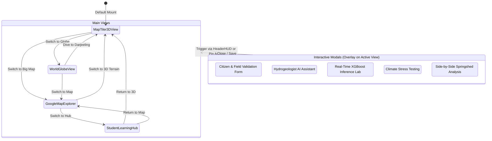
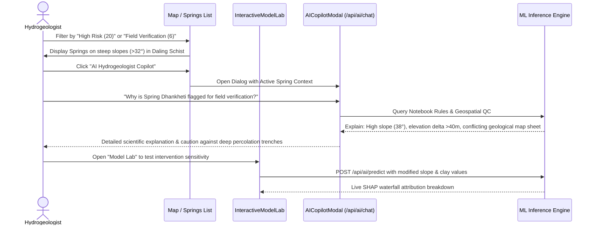
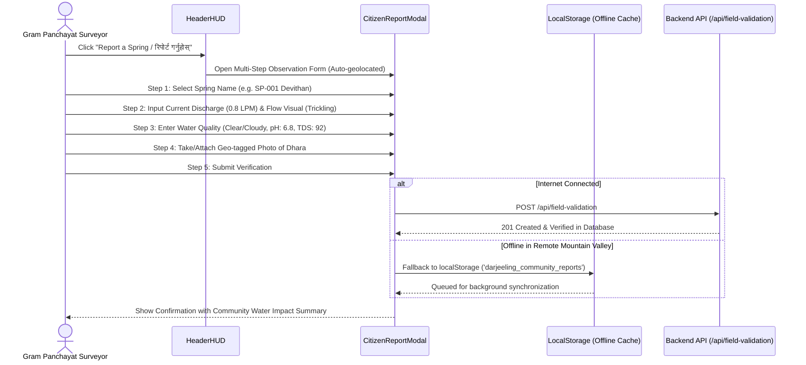
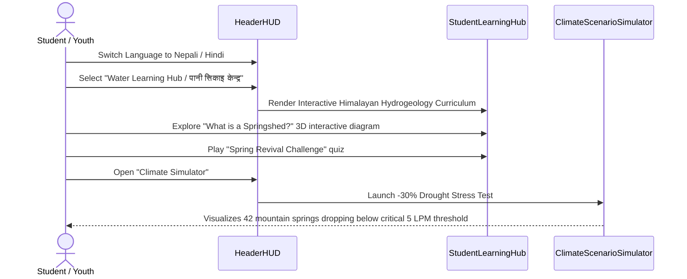
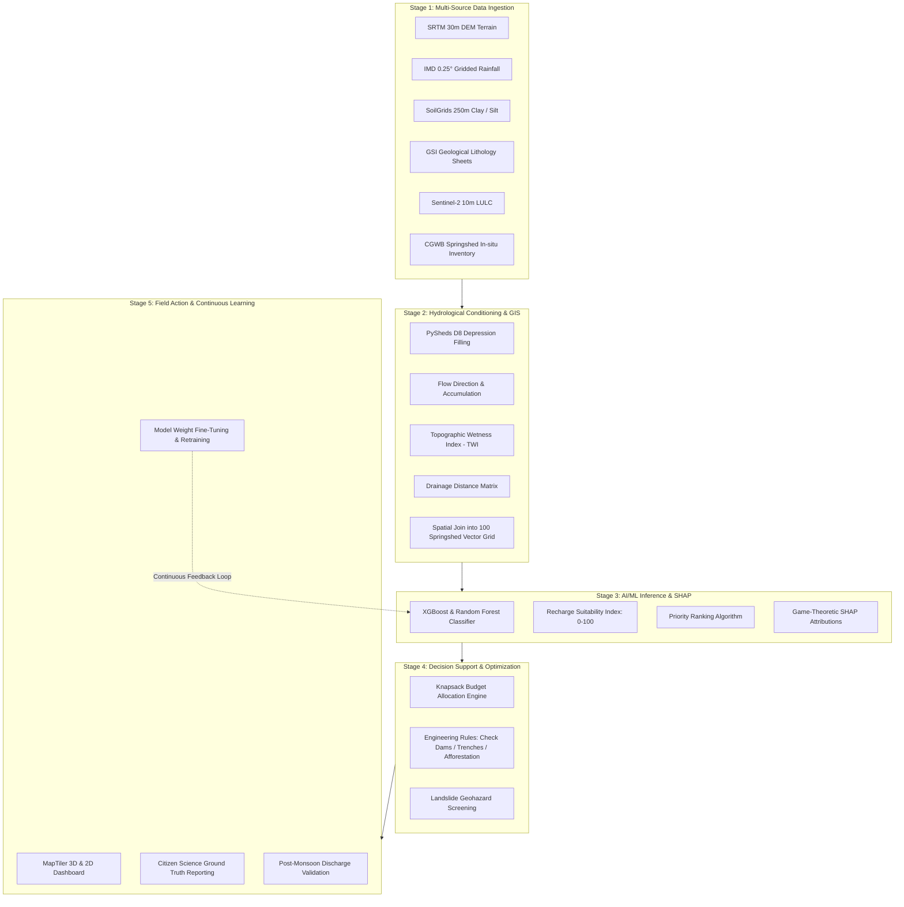

# Application Flow (AppFlow) — SIH26240

## 1. System Navigation & View Hierarchy

The **Darjeeling Springshed Revival Decision Support System (DSS)** operates as a single-page reactive application running on a unified HUD telemetry shell. The user can switch seamlessly between four specialized spatial perspectives while retaining active state (selected spring, budget allocation, language context, active filters).



---

## 2. End-to-End User Personas & Workflows

### 2.1 Persona 1: District Magistrate / Jal Jeevan Mission Planner
*Goal: Allocate district development funds optimally to revive maximum mountain springs before the dry pre-monsoon season.*

```mermaid
sequenceDiagram
    actor Admin as District Magistrate
    participant HUD as HeaderHUD (Telemetry)
    participant Opt as Optimizer Engine (/api/optimizer)
    participant Map as MapTiler 3D Scene
    participant Comp as SpringComparisonModal

    Admin->>HUD: Adjust Budget Slider (e.g., from ₹1.20 Cr to ₹2.50 Cr)
    HUD->>Opt: POST /api/optimizer { budget: 25000000 }
    Opt-->>HUD: Returns revived count (68), recharge (14.2M L), structures breakdown
    HUD->>Map: Update Pin Glows (Unfunded -> Funded Status)
    Admin->>Map: Click on Top Priority Spring (e.g., Bimla Dhara)
    Map->>HUD: Open Details Drawer (Contour trenches + check dam cost: ₹2.8 Lakhs)
    Admin->>HUD: Click "Compare Springs"
    HUD->>Comp: Open Side-by-Side Comparison (Bimla Dhara vs Devithan)
    Comp-->>Admin: Displays ROI: Liters Recharged per Rupee Invested
    Admin->>HUD: Export Priority PDF / Work Order
```

### 2.2 Persona 2: Field Hydrogeologist & Geotechnical Officer
*Goal: Inspect recharge suitability scores, diagnose hydro-structural drivers (SHAP), and screen for landslide risks.*



### 2.3 Persona 3: Gram Panchayat Pradhan & Citizen Surveyor
*Goal: Report drying spring discharge, water quality symptoms, and verify structural status directly from the village.*



### 2.4 Persona 4: High School Student & Youth Environmental Volunteer
*Goal: Understand the Himalayan hydrological cycle, mountain fractures, and how springs function.*



---

## 3. Data Processing & Feedback Pipeline Flow

The platform operates on a closed-loop 5-stage continuous learning lifecycle:



---

## 4. Hotkey Navigation & Keyboard Access Matrix

To support high-velocity field presentations and accessibility, the application binds global keyboard shortcuts:

| Key Binding | Target Action | Scope |
|-------------|---------------|-------|
| `ArrowRight` or `D` | Advance to Next Spring (Cycles 1 → 100) | Global (except active inputs) |
| `ArrowLeft` or `A` | Backtrack to Previous Spring (Cycles 100 → 1) | Global (except active inputs) |
| `Escape` | Dismiss active modal dialog / drawer | Modal Context |
| `Tab` / `Shift+Tab` | Accessible focus traversal | Modal & Form Controls |
