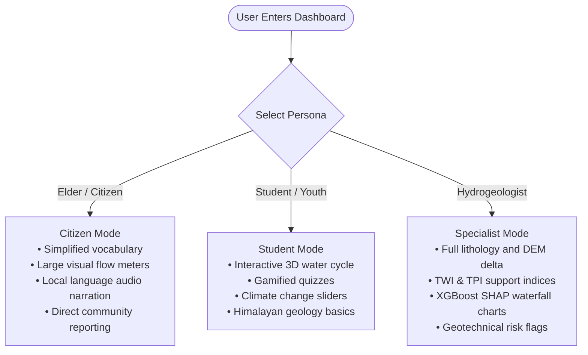

# Design Document & UI/UX Architecture — SIH26240

## 1. Design Vision & Aesthetic Philosophy

The **Darjeeling Springs Revival Decision Support System (DSS)** is styled as a **Cyber-Physical Himalayan Command Center**. Rather than an ordinary administrative dashboard, it blends scientific GIS precision with a futuristic, tactile, and immersive user experience.

### Core Principles
1. **Immersion Through 3D Geospatial Context**: Grounding high-altitude hydrogeology in real 3D terrain so stakeholders instantly grasp how slope, ridge morphology, and fault lines dictate water percolation.
2. **Layered Information Density**: High-level decision metrics (recharge volume, revived count, budget efficiency) are visible in the HUD at a glance, while deep scientific telemetry (lithological sheet codes, TPI, SHAP values) is available upon selection.
3. **Inclusive Adaptive Personas**: Recognizing that the platform must serve illiterate mountain farmers, school children, civil engineers, and district magistrates alike.

---

## 2. Design System & Design Tokens

### 2.1 Color Palette

```
  Background (Space Obsidian)      Surface / Cards (Glass Slate)      Accent Cyan (Water/Recharge)
  #050814                         rgba(15, 23, 42, 0.75)             #00F0FF / #06B6D4
  
  Success Emerald (Revived/Safe)  Warning Amber (Moderate Risk)      Danger Rose (High Hazard/Unresolved)
  #10B981                         #F59E0B                            #F43F5E
```

| Token Name | Hex / RGBA | Tailwind Equivalent | Semantic Role |
|------------|------------|---------------------|---------------|
| `bg-space-dark` | `#050814` | `bg-[#050814]` | App canvas root background |
| `surface-glass` | `rgba(15, 23, 42, 0.75)` | `bg-slate-900/75 backdrop-blur-md` | Modals, cards, and drawers |
| `border-glass` | `rgba(255, 255, 255, 0.1)` | `border-white/10` | Subtle glassmorphic boundaries |
| `neon-cyan` | `#00F0FF` | `text-cyan-400 border-cyan-500` | Water flow, recharge metrics, active tabs |
| `emerald-glow` | `#10B981` | `text-emerald-400 bg-emerald-500/20` | Primary Zone, revived status, potable water |
| `amber-glow` | `#F59E0B` | `text-amber-400 bg-amber-500/20` | Moderate priority, site-specific assessments |
| `rose-danger` | `#F43F5E` | `text-rose-400 bg-rose-500/20` | Steep slopes (>32°), field verification required |

### 2.2 Typography Hierarchy

We utilize clean geometric sans-serif fonts with monospaced numerical telemetry accents:
- **Headings & Brand Title**: `Inter`, `system-ui`, weight 700 / 800 with subtle text gradients (`bg-gradient-to-r from-cyan-400 to-blue-500 bg-clip-text text-transparent`).
- **Body & Controls**: `Inter`, weight 400 / 500, tracking normal to wide.
- **Telemetry Counters & Coordinates**: Monospace numerals (`font-mono tracking-tight`) for elevation (m), discharge (LPM), coordinates (GPS), and rupee currency figures.

### 2.3 Glassmorphism Specifications
- **Backdrop Blur**: `backdrop-blur-xl` (16px to 24px)
- **Background Fill**: `rgba(10, 16, 31, 0.72)`
- **Border**: `1px solid rgba(255, 255, 255, 0.08)` with selective directional gradient borders on hover
- **Drop Shadow**: `0 20px 50px rgba(0, 0, 0, 0.6)`

---

## 3. Multi-Persona Adaptive UX

The platform includes a dedicated **Persona Switcher** in the top navigation HUD, seamlessly adapting interface complexity to the logged-in user:



### 3.1 Citizen / Elder View
- Labels replace technical jargon with intuitive mountain terms (e.g. `Discharge: 1.2 LPM` becomes `Water Flow: Moderate / मध्यम बहाव`).
- Integrated **Text-to-Speech (TTS) Web Speech Audio Narration** reading spring diagnostics aloud in English, Nepali, Hindi, or Bengali.
- Direct quick-action button: *"Report Dhara Issue"* with photo capture.

### 3.2 Specialist / Hydrogeologist View
- Displays full 52-parameter telemetry:
  - Topographic Position Index (TPI) Support
  - Drainage & Slope Support vectors
  - DEM vs GPS Elevation QC discrepancies
  - Rock unit categorization (Daling Schist / Darjeeling Gneiss / Lingtse Granite)
  - Interactive Model Lab access for live parameter tweaking.

### 3.3 Youth & Student Learning Hub
- Gamified exploration center designed for mountain schools.
- Visual animations depicting rain infiltration, unconfined recharge aquifers, fractures, and spring orifices.

---

## 4. Component Layout Architecture

```
+-----------------------------------------------------------------------------------------+
| [HeaderHUD]                                                                             |
| Logo | Budget Slider [ ₹1.20 Cr ] | Live Telemetry: 52 Revived | 14.8M L | Lang [NE/EN] |
| Nav: [3D Terrain] [Big Map] [World Globe] [Learning Hub] | Actions: [AI Copilot] [Report] |
+-----------------------------------------------------------------------------------------+
|                                                                                         |
| [Active Viewport: MapTiler 3D Scene / Google Maps Explorer / Three.js World Globe]       |
|                                                                                         |
|  +---------------------------+                           +---------------------------+  |
|  | [Floating Filters Widget] |                           | [Spring Details Drawer]   |  |
|  | Search: [ Devithan... ]   |                           | SP-001: Devithan Dhara    |  |
|  | (*) All 100 Springs       |                           | Elevation: 1130 m         |  |
|  | ( ) Top 15 Priority       |                           | Discharge: 1.2 LPM        |  |
|  | ( ) Primary Zone (88)     |                           | Geology: Daling Schist    |  |
|  | ( ) High Risk (20)        |                           | Rec: Contour Infiltration |  |
|  | ( ) Field Verify (6)      |                           | [Fly To] [Audio] [Lab]    |  |
|  +---------------------------+                           +---------------------------+  |
|                                                                                         |
+-----------------------------------------------------------------------------------------+
| [Bottom Telemetry Bar]  Catchment: 111.04 km² | Backend Status: 🟢 Connected | Hotkeys: A/D |
+-----------------------------------------------------------------------------------------+
```

### 4.1 HeaderHUD
- Positioned absolutely across `top-0 left-0 right-0 z-30` with `pointer-events-none` container and `pointer-events-auto` controls.
- Contains the continuous **Budget Allocation Slider (₹0 to ₹5.0 Crores)**. As the slider drags, numbers animate smoothly via CSS transitions, and funded pins update their halo lighting in real time.

### 4.2 MapTiler 3D Mountain Viewport
- Utilizes `@maptiler/sdk` with high-resolution digital elevation raster tiles (Terrain-RGB) calibrated specifically to the Kangchenjunga-Darjeeling Ridge (`lat: 27.03, lng: 88.26, pitch: 58°, bearing: -20°`).
- Custom HTML Marker layers with pulsing CSS rings:
  - Green pulsing beacon: Revived / Funded
  - Amber beacon: Partially Funded / Assessment required
  - Red / Orange beacon: Critical flow / Unresolved field verification

### 4.3 Floating Modals & Drawers
- Built with accessible `<dialog>` patterns and animated with `framer-motion` for spring-physics scale-in (`scale: 0.95 -> 1.0`, `opacity: 0 -> 1`).
- Dismissible via background backdrop tap, dedicated `X` close button, or keyboard `Escape`.

---

## 5. Mobile & Responsive Layout Rules

| Screen Width | Layout Mode | Adjustments |
|--------------|-------------|-------------|
| `< 640px` (Mobile) | Compact Mobile HUD | Header metrics collapse into expandable drawer; budget slider displays compact badge; drawer occupies full bottom screen (height: 55vh). |
| `640px - 1024px` (Tablet) | Hybrid Adaptive | Floating left panel collapses to top icon bar; 3D viewport remains touch-interactive with pinch-to-zoom and two-finger pitch. |
| `> 1024px` (Desktop / Video Wall) | Command Center | Full persistent HUD with floating multi-column telemetry panels and side-by-side modal docking. |
