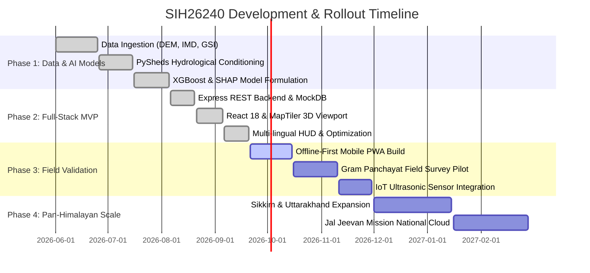

# Implementation Plan & Execution Roadmap — SIH26240

## 1. Executive Summary & Phased Strategy

The **SIH26240 Spring Revival Initiative** is organized into four distinct implementation phases transitioning from research-grade hydrological data processing to a production-grade cyber-physical decision support system deployed across the Indian Himalayan Region (IHR).



---

## 2. Detailed Phase Breakdown

### Phase 1: Scientific Foundation & Hydro-ML Engine (Completed ✅)
* **Milestone 1.1**: Spatial ingestion of 30m SRTM DEM, SoilGrids 250m clay fractions, IMD 0.25° gridded precipitation, and Sentinel-2 10m LULC rasters.
* **Milestone 1.2**: Hydrological depression filling and flow direction computation via PySheds; calculation of Topographic Wetness Index (TWI) and Topographic Position Index (TPI).
* **Milestone 1.3**: Master dataset compilation of 100 benchmark Darjeeling springs covering 111.04 km² catchment area.
* **Milestone 1.4**: Training and validation of XGBoost & Random Forest ensembles; computation of game-theoretic Shapley feature attributions (SHAP).

### Phase 2: Cyber-Physical Decision Support Platform (Completed ✅)
* **Milestone 2.1**: Node.js & Express.js microservice architecture with endpoints for springs data, AI prediction, budget optimization, and field observation sync.
* **Milestone 2.2**: High-performance React 18 client with MapTiler 3D terrain rendering, Three.js WebGL global view, and Google Maps explorer.
* **Milestone 2.3**: Implementation of the dynamic ₹0 to ₹5 Crore budget optimizer calculating real-time recharge surges, revived counts, and civil structures breakdown.
* **Milestone 2.4**: Multi-lingual context provider supporting English, Nepali (native hill tongue), Hindi, and Bengali with audio narration.

### Phase 3: Field Validation & Community Pilot (Active 🚀)
* **Milestone 3.1**: Standalone Progressive Web App (PWA) with offline `IndexedDB` caching for village surveyors working without cellular reception.
* **Milestone 3.2**: Pilot field verification of the 6 unresolved springs (e.g., SP-002 Dhankheti) in collaboration with Darjeeling Gram Panchayats.
* **Milestone 3.3**: Deployment of 5 low-cost ultrasonic telemetry sensors testing real-time LPM discharge logging via LoRaWAN/GSM.

### Phase 4: Pan-Himalayan Scale-out (Planned 📅)
* **Milestone 4.1**: Automated ETL pipeline ingesting state-level spring inventories from Uttarakhand, Himachal Pradesh, Sikkim, and Meghalaya.
* **Milestone 4.2**: Direct API integration with the National Water Informatics Centre (NWIC) and Jal Jeevan Mission (JJM) central monitoring dashboard.

---

## 3. Work Breakdown Structure (WBS) & Sprint Schedule

```
SIH26240 Platform
├── 1.0 Data & Geo-Processing Pipeline
│   ├── 1.1 Satellite DEM Ingestion & Resampling
│   ├── 1.2 D8 Hydrological Routing & Catchment Delimitation
│   └── 1.3 Multi-Criteria Decision Analysis (MCDA) Scoring
├── 2.0 AI/ML Services
│   ├── 2.1 XGBoost Recharge Suitability Model
│   ├── 2.2 SHAP Explainer Microservice
│   └── 2.3 Climate Scenario What-If Regressor
├── 3.0 Web Application & GIS
│   ├── 3.1 MapTiler 3D Terrain Integration
│   ├── 3.2 Google Maps Cluster Layer
│   ├── 3.3 Interactive Model Lab
│   └── 3.4 Multi-Lingual Speech & Narration Module
└── 4.0 Field Ground-Truthing
    ├── 4.1 Mobile Field Survey Interface
    ├── 4.2 Geo-tagged Image Upload & Exif Extraction
    └── 4.3 Gram Panchayat Training & Feedback
```

---

## 4. Resource Allocation & Team Responsibilities

| Role | Primary Responsibilities | Key Deliverables |
|------|--------------------------|------------------|
| **Hydrogeology Lead** | Geological mapping, lithological interpretation, intervention rules | Structural validation, fracture analysis |
| **GIS & Data Scientist** | PySheds raster conditioning, DEM derivatives, ML & SHAP pipeline | `SIH26240_Spring_Revival_Final.ipynb`, trained weights |
| **Full-Stack Lead** | Express.js API design, React 18 dashboard architecture, state management | REST microservices, telemetry HUD |
| **3D / WebGL Engineer** | MapTiler SDK 3D terrain rendering, Three.js globe, shader optimization | 60 FPS terrain viewport, dynamic pin shaders |
| **Field & Community Specialist** | Citizen science module, multi-lingual translations (Nepali/Bengali), user testing | Field survey PWA, Panchayat user trials |

---

## 5. Risk Assessment & Mitigation Matrix

| Risk Event | Severity | Probability | Mitigation Strategy |
|------------|----------|-------------|---------------------|
| **Remote mountain areas have zero mobile connectivity** | High | High | Offline-first architecture using `localStorage` / `IndexedDB` with automated optimistic sync when reconnected. |
| **Steep terrain induces artificial slope failure from trenches** | Critical | Medium | Hardcoded **Geotechnical Landslide Guard** automatically disallowing deep excavation on slopes `> 32°`. |
| **Satellite DEM inaccuracies in deep Himalayan gorges** | Medium | Medium | Quality Control flag (`Elevation_QC`) cross-referencing GPS survey elevations against 30m DEM neighborhood medians. |
| **Community resistance to intervention methods** | Medium | Low | Gram Panchayat inclusion, local Nepali-language educational modules, and visual water impact proof. |
| **API rate limiting on commercial map tiles** | Low | Low | Dual-engine architecture: MapTiler 3D for terrain, Google Maps for 2D, and local Leaflet/GeoJSON fallback. |

---

## 6. Verification & Quality Assurance Gates

1. **Model Convergence Gate**: XGBoost model cross-validation accuracy $\ge 85\%$ against in-situ measured discharges.
2. **Performance Gate**: 3D Terrain rendering maintaining sustained $\ge 45\text{ FPS}$ on standard mid-tier consumer hardware.
3. **Data Integrity Gate**: Zero `NaN` or unhandled coordinate exceptions across all 100 springs datasets.
4. **Accessibility & Linguistic Gate**: 100% translation key coverage across English, Nepali, Hindi, and Bengali.
