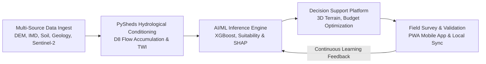

# SIH26240: Darjeeling Springshed Revival DSS — Documentation Suite

Welcome to the central documentation hub for **SIH26240 — AI/ML-Driven Decision Support System for Springshed Management and Himalayan Spring Revival in Darjeeling Hills, West Bengal**.

This documentation package provides an exhaustive, production-grade technical, operational, and scientific dossier supporting the software platform, hydrogeological models, GIS pipelines, and community validation mechanisms.

---

## 📚 Document Index

| # | Document | File | Target Audience | Primary Focus |
|---|----------|------|-----------------|---------------|
| 1 | **Application Flow** | [Appflow.md](file:///c:/Users/Lenovo/Desktop/project_SIH01/Main%20SIH%20project/docs/Appflow.md) | Engineers, UX Designers, Evaluators | End-to-end user journeys, navigation state machines, data flow diagrams |
| 2 | **Design Document** | [Design.md](file:///c:/Users/Lenovo/Desktop/project_SIH01/Main%20SIH%20project/docs/Design.md) | Frontend Devs, UI/UX, Product Leads | Dark glassmorphism design system, 3D WebGL viewport, HUD, personas |
| 3 | **Implementation Plan** | [ImplementationPlan.md](file:///c:/Users/Lenovo/Desktop/project_SIH01/Main%20SIH%20project/docs/ImplementationPlan.md) | Project Managers, Lead Engineers | 4-phase rollout, sprint breakdown, milestones, pan-Himalayan scaling |
| 4 | **Product Requirements (PRD)** | [PRD.md](file:///c:/Users/Lenovo/Desktop/project_SIH01/Main%20SIH%20project/docs/PRD.md) | Stakeholders, Govt Bodies, Product Managers | Problem statement, functional/non-functional requirements, KPIs |
| 5 | **Research & Resources** | [ResearchAndResources.md](file:///c:/Users/Lenovo/Desktop/project_SIH01/Main%20SIH%20project/docs/ResearchAndResources.md) | Hydrogeologists, Data Scientists | Scientific literature, PySheds, SRTM/SoilGrids/IMD data, XGBoost & SHAP |
| 6 | **Engineering & Hydro Rules** | [Rules.md](file:///c:/Users/Lenovo/Desktop/project_SIH01/Main%20SIH%20project/docs/Rules.md) | Civil Engineers, Hydrogeologists | Intervention guidelines (trenches, check dams, pits), landslide hazard guards |
| 7 | **Data Schema & APIs** | [Schema.md](file:///c:/Users/Lenovo/Desktop/project_SIH01/Main%20SIH%20project/docs/Schema.md) | Backend/Frontend Devs, Database Admins | 52-column master dataset, GeoJSON structures, REST API contracts, DDL |
| 8 | **Technical Specification** | [TechSpec.md](file:///c:/Users/Lenovo/Desktop/project_SIH01/Main%20SIH%20project/docs/TechSpec.md) | System Architects, Full-Stack Devs | Client-server architecture, 3D GIS engine, mathematical formulas, security |
| 9 | **Project Tracker** | [Tracker.md](file:///c:/Users/Lenovo/Desktop/project_SIH01/Main%20SIH%20project/docs/Tracker.md) | Hackathon Team, Mentors, Evaluators | Feature status, SIH evaluation matrix, testing checklist, sprint backlog |

---

## 🏔️ Project Overview at a Glance

- **Problem ID**: SIH26240
- **Pilot Location**: Darjeeling Hills District, West Bengal, India
- **Catchment Coverage**: 111.04 km² across 100 benchmark Himalayan springs (dharas)
- **Primary Target Beneficiaries**: 50,000+ mountain residents across vulnerable gram panchayats
- **Core Technology Stack**: React 18, MapTiler 3D SDK, Three.js, Express.js, PySheds, XGBoost, SHAP
- **Multi-lingual Support**: English (`en`), Nepali (`ne`), Hindi (`hi`), Bengali (`bn`)
