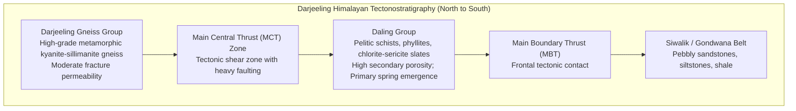

# Research & Scientific Resources — SIH26240

## 1. Scientific Background & Hydrogeology

### 1.1 Springshed vs Watershed Paradigm
In high-altitude mountain terrains like the Darjeeling Himalayas (part of the Lesser and Higher Himalayan geomorphic provinces), traditional **surface watershed** boundaries rarely coincide with **subsurface springshed** boundaries:

* **Watershed**: Topographic catchment defined strictly by ridge lines directing surface water runoff into a common stream.
* **Springshed**: The subterranean catchment area (recharge zone) that feeds a specific unconfined or perched mountain aquifer feeding a spring orifice (*Dhara*), governed by bedrock lithology, fracture dip, strike directions, and tectonic lineaments.

```
Topographic Ridge (Surface Watershed Divide)
         |
    Rainfall Infiltration
         \
          \  Infiltration along Rock Fractures & Foliation Planes (30° Dip)
           \---> Subsurface Recharge Aquifer
                  \
                   \---> Spring Orifice (Dhara) Emergence
                         (Located in adjacent surface valley!)
```

Recharging a spring requires interventions placed within its **subsurface recharge zone**, which may be hundreds of meters uphill or across a minor topographic fold.

---

## 2. Geological Formations in the Darjeeling Pilot

Based on the Geological Survey of India (GSI) 1:50,000 mapping sheets (Sheets 78A/8, 78B/5) and the benchmark dataset:



### 2.1 Hydrogeological Properties of Key Units

| Geological Unit | GSI Sheet Code | Dominant Rock Types | Secondary Porosity | Hydrogeological Behavior |
|-----------------|----------------|---------------------|--------------------|--------------------------|
| **Daling Group** | `921`, `93` | Schists, Phyllites, Chlorite Slates | High (Dense micro-fractures) | **Highest spring emergence density**; excellent secondary storage when protected from shear landslides. |
| **Darjeeling Gneiss** | `831` | Garnetiferous Gneiss, Granulites | Moderate (Foliation joints) | Higher elevation springs; sustained perennial baseflow but slower percolation rates. |
| **Lingtse Granite** | `712` | Foliated biotite granite-gneiss | Low to Moderate (Localized joints) | Perched aquifers; springs vulnerable to rapid discharge drops post-monsoon. |
| **Gondwana / Siwalik** | `611` | Sandstone, Carbonaceous shale | Moderate to High | Foothill unconfined aquifers with high sand fraction. |

---

## 3. Hydrological Conditioning with PySheds

In steep mountain terrain, raw satellite digital elevation models (DEMs) suffer from artificial pits, digital dams, and sensor artifacts. We utilize the **PySheds** Python library to hydro-condition the terrain:

```python
from pysheds.grid import Grid

# 1. Load 30m SRTM DEM
grid = Grid.from_raster("darjeeling_srtm_30m.tif")
dem = grid.read_raster("darjeeling_srtm_30m.tif")

# 2. Fill depressions (pits) where water artificially pools
pit_filled = grid.fill_depressions(dem)

# 3. Resolve flat surfaces to determine genuine slope trajectories
flats_resolved = grid.resolve_flats(pit_filled)

# 4. Compute D8 Flow Direction (Steepest descent to one of 8 neighbors)
fdir = grid.flowdir(flats_resolved)

# 5. Compute Flow Accumulation (Number of upstream cells draining into each cell)
facc = grid.accumulation(fdir)
```

### Key Hydro-Terrain Equations

1. **Topographic Wetness Index (TWI)**:
   $$TWI = \ln\left(\frac{\alpha}{\tan \beta}\right)$$
   Where:
   * $\alpha$: Upslope contributing drainage area per unit contour length ($m^2/m$).
   * $\beta$: Local terrain slope angle in radians.
   * *Interpretation*: High TWI ($> 12$) identifies valley bottoms and drainage channels; moderate TWI ($6 - 10$) marks prime hillside infiltration zones.

2. **Topographic Position Index (TPI)**:
   $$TPI = z_0 - \bar{z}$$
   Where $z_0$ is the central cell elevation and $\bar{z}$ is the mean elevation of the surrounding neighborhood (radius $500\text{ m}$).
   * $TPI > 0$: Ridges and hilltops.
   * $TPI \approx 0$: Flat plains or uniform continuous slopes.
   * $TPI < 0$: Gorges, valleys, and incision basins.

---

## 4. Machine Learning & Explainable AI (SHAP)

### 4.1 Why Gradient Boosted Decision Trees (XGBoost)?
Hydrogeological spring emergence is fundamentally non-linear and conditional:
* High rainfall only generates recharge if slope is $\le 28^\circ$; on $38^\circ$ slopes, it causes destructive torrents and landslides.
* High clay content ($> 35\%$) impedes infiltration, whereas moderate clay ($20-30\%$) provides optimal moisture retention.
* Decision tree ensembles capture these interaction thresholds without assuming Gaussian distributions.

### 4.2 Shapley Additive Explanations (SHAP) Formulation
To ensure local hydrologists trust the AI, predictions are decomposed into game-theoretic Shapley values:

$$\phi_i(v) = \sum_{S \subseteq N \setminus \{i\}} \frac{|S|!(|N|-|S|-1)!}{|N|!} \left[ v(S \cup \{i\}) - v(S) \right]$$

Where:
* $N$: Complete set of 7 hydro-terrain features.
* $S$: Any subset of features excluding feature $i$.
* $v(S)$: Model prediction using only features in $S$.
* $\phi_i$: Marginal contribution of feature $i$ to the final suitability score.

In our production engine (`mlModelService.js`), SHAP values are visualized as waterfall attribution bars explaining whether slope, lithology, rainfall, or clay pushed the spring toward high or low priority.

---

## 5. Primary Datasets & Sources

| Dataset Name | Spatial Resolution | Temporal Baseline | Source Agency | Parameter Extracted |
|--------------|--------------------|-------------------|---------------|---------------------|
| **SRTM 1-Arc-Second Global DEM** | $30\text{ m}$ | Mission v3 | NASA / USGS | Elevation ($m$), Slope ($^\circ$), Aspect, TPI, TWI |
| **SoilGrids 2.0 Global Soil Data** | $250\text{ m}$ | 2020 Release | ISRIC World Soil Info | Clay content at 0-5 cm depth ($g/kg$ / $\%$) |
| **IMD Gridded Precipitation** | $0.25^\circ \times 0.25^\circ$ | 2023 Annual | India Meteorological Dept | Annual monsoon & pre-monsoon precipitation ($mm$) |
| **Sentinel-2 LULC (WorldCover)** | $10\text{ m}$ | 2021-2023 | European Space Agency (ESA) | Tree cover, Shrubland, Cropland, Built-up |
| **GSI Geological Quadrangles** | 1:50,000 scale | Quadrangle Sheets 78A/8, 78B/5 | Geological Survey of India | Bedrock lithology, fault lineaments, dip/strike |
| **CGWB Springs Inventory** | Point GPS surveys | 2021-2024 | Central Ground Water Board | Baseline discharge (LPM), pH, TDS, seasonality |

---

## 6. Key Scientific References

1. **NITI Aayog (2018)**. *Report of Working Group I: Inventory and Revival of Springs in the Himalayas for Water Security*. Government of India, New Delhi.
2. **Mahamuni, K., & Kulkarni, H. (2012)**. *Groundwater flows and springs in the Himalayan region: Springshed management principles*. ACWADAM Technical Bulletin.
3. **Lundberg, S. M., & Lee, S.-I. (2017)**. *A Unified Approach to Interpreting Model Predictions*. Advances in Neural Information Processing Systems (NeurIPS 30).
4. **Chen, T., & Guestrin, C. (2016)**. *XGBoost: A Scalable Tree Boosting System*. ACM SIGKDD International Conference on Knowledge Discovery and Data Mining.
5. **Bartarya, S. K. (2018)**. *Spring sources in the Lesser Himalayan crystalline rocks: Hydrogeology, recharge zone protection, and revival techniques*. Journal of Hydrology: Regional Studies.
