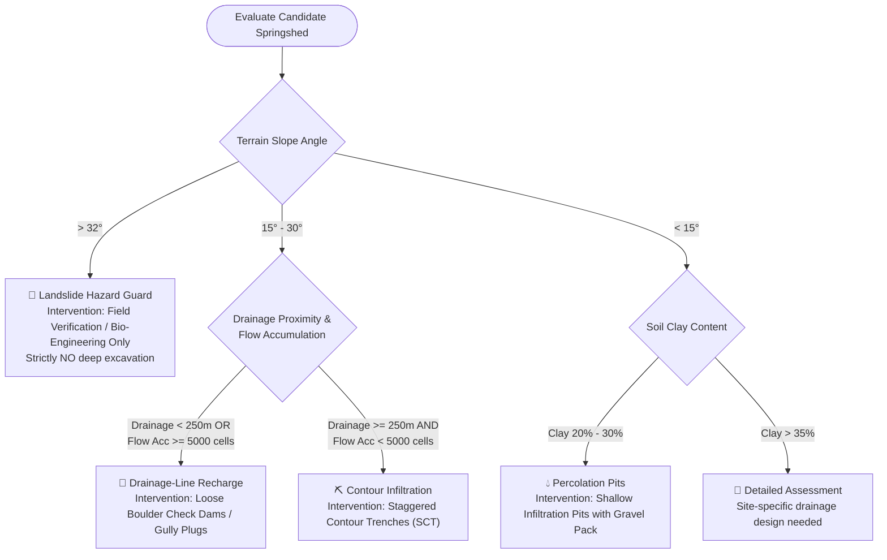

# Hydrogeological Rules & Geotechnical Constraints — SIH26240

## 1. Overview & Regulatory Context

This document codifies the hydrogeological logic, civil engineering thresholds, and geotechnical safety protocols embedded within the **SIH26240 Decision Support System**. These rules ensure that artificial recharge interventions in steep, fragile Himalayan terrain enhance groundwater percolation **without inducing slope instability, debris flows, or catastrophic landslides**.

---

## 2. Engineering Intervention Selection Matrix

The system automates the selection of 5 indicative intervention categories based on physical terrain constraints:



---

## 3. Detailed Specifications by Intervention Type

### 3.1 Contour Infiltration Trenches (Continuous / Staggered)
* **Indicative Code**: `CONTOUR_TRENCH`
* **Trigger Conditions**:
  * Slope: $15^\circ \le \text{Slope} \le 30^\circ$
  * Flow Accumulation: $< 5,000\text{ cells}$ (surface sheet flow rather than channelized streams)
  * Bedrock: Fractured schist, phyllite, or weathered gneiss
* **Design Standards**:
  * Dimension: $0.5\text{ m wide} \times 0.5\text{ m deep} \times 3.0\text{ m to } 5.0\text{ m length}$
  * Interval: $5\text{ m to } 8\text{ m}$ vertical spacing along exact contour lines
  * Infiltration Media: Backfilled with $20\text{ mm}$ river shingles to prevent silt clogging
* **Expected Cost**: ₹2.20 Lakhs per kilometer of staggered trenching.

### 3.2 Drainage-Line Recharge & Check Dams
* **Indicative Code**: `CHECK_DAM_GULLY`
* **Trigger Conditions**:
  * Distance to Drainage: $\le 250\text{ meters}$
  * Flow Accumulation: $\ge 5,000\text{ cells}$ (established mountain rills and gullies)
  * Slope: Rocky valley slopes with stable bed foundations
* **Design Standards**:
  * Type: Dry loose stone masonry check dams or wire-mesh gabion crates
  * Height: $\le 1.2\text{ meters}$ (prohibiting high hydraulic head pressure on mountain stream beds)
  * Spillway: Central depression to pass peak monsoon cloudburst discharges safely
* **Expected Cost**: ₹3.50 Lakhs per multi-tier check dam structure.

### 3.3 Percolation Pits & Shallow Recharge Wells
* **Indicative Code**: `PERCOLATION_PIT`
* **Trigger Conditions**:
  * Slope: $\le 15^\circ$ (gentle terraces, tea gardens, plateau saddles)
  * Soil: Sand and loamy clay with percolation rate $> 25\text{ mm/hr}$
* **Design Standards**:
  * Circular or rectangular pits: $1.5\text{ m} \times 1.5\text{ m} \times 2.0\text{ m}$ deep
  * Filter Layers: Bottom $0.5\text{ m}$ coarse boulders, middle $0.5\text{ m}$ crushed gravel, top sand filter
* **Expected Cost**: ₹45,000 per percolation pit cluster.

### 3.4 Catchment Afforestation & Vegetative Buffers
* **Indicative Code**: `AFFORESTATION`
* **Trigger Conditions**:
  * Land Cover: Degraded shrubland, degraded tea estates, or over-grazed slopes
  * Soil Depth: Moderate to thin
* **Recommended Mountain Species**:
  * Native Oak (*Quercus lamellosa*, *Quercus lineata*) — deep root sponge systems
  * Utis / Nepalese Alder (*Alnus nepalensis*) — rapid nitrogen fixation and slope stabilization
  * Rhododendron arboreum (*Lali Gurans*) — dense sub-canopy undergrowth
* **Strict Prohibitions**:
  * ❌ *Cryptomeria japonica* (Dupi / Japanese Cedar): Shallow horizontal root system; causes soil acidization and prevents understory vegetation.

---

## 4. Geotechnical Landslide Hazard Guard (CRITICAL SAFETY)

> [!CAUTION]
> In Himalayan tectonically active zones, improper water accumulation on steep hillsides lubricates slip planes and induces devastating slope failures.

### Rule 4.1: Slope Cut-Off Restriction
* If local slope $\beta > 32^\circ$:
  * **Automated Action**: System tags the spring as `Risk_Level = 'High'` and switches intervention to `Field Verification`.
  * **Civil Restriction**: Zero trench excavation or check dam construction is permitted until a certified engineering geologist completes an in-situ shear-strength borehole survey.

### Rule 4.2: Tectonic Fault Line Proximity
* If distance to Main Central Thrust (MCT) or local fault lineament is $< 50\text{ meters}$:
  * All artificial concentrated water pooling is prohibited.
  * Only bio-engineering slope stabilization (Vetiver grass hedging, bamboo crib walls) is permitted.

### Rule 4.3: High Clay Soil Liquefaction
* If topsoil clay content $> 35\%$ and annual rainfall $> 2,800\text{ mm}$:
  * Avoid surface percolation pits without subterranean drainage pipes, as waterlogged clay forms impermeable slurries prone to mudslides.

---

## 5. Quality Control (QC) & Validation Rules

### Rule 5.1: Elevation QC Anomaly Detection
```
Elevation_Difference = DEM_Elevation - GPS_Survey_Elevation
```
* If $|Elevation\_Difference| > 40\text{ meters}$:
  * Flag: `Elevation_QC = 'FLAGGED_REVIEW'`
  * Cause: GPS multipath error under dense Himalayan forest canopy or steep cliff shadow in 30m SRTM DEM.
  * Action: Override with 30m DEM neighborhood median until differential GPS (DGPS) survey is executed.

### Rule 5.2: Geological Sheet Boundary Resolution
* If spring coordinates lie within $100\text{ m}$ of a quadrangle sheet boundary (e.g. between Sheet 78A/8 and Sheet 78B/5):
  * Flag: `Geology_QC = 'VISUAL_REVIEW'`
  * Action: Inspect adjacent structural strike/dip measurements to verify foliation continuity.

---

## 6. Citizen Science & Community Governance Rules

1. **Prior Informed Consent**: No civil excavation may commence on community-held commons without approval from the local *Gram Sabha* under the Panchayats (Extension to Scheduled Areas) / West Bengal Panchayat Act.
2. **Citizen Submission Validation**:
   * A citizen report is classified as `Verified` if:
     1. Discharge measurement method is specified (Bucket & Stopwatch or V-Notch weir).
     2. GPS coordinates match known spring master record within $200\text{ m}$.
     3. An authenticated photograph is submitted showing the spring orifice.
3. **Open Access Data Transparency**: All springshed health indices and water quality reports are public goods accessible in local languages to empower water users.
