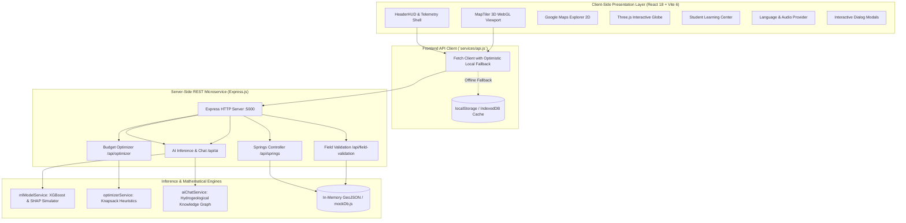

# Technical Specification (TechSpec) — SIH26240

## 1. System Architecture Overview

The **SIH26240 Decision Support System** follows a decoupled client-server architecture designed for high-performance 3D geospatial rendering, real-time mathematical optimization, and robust offline field resilience.

---

## 2. Technology Stack & Runtime Dependencies

### 2.1 Frontend Stack
* **Core Framework**: React 18.3.1 (Concurrent Rendering, `useMemo`, `useCallback`)
* **Build Tool**: Vite 6.2.0 (ESM Hot Module Replacement, Rollup production bundler)
* **Styling & Design System**: Tailwind CSS 3.4.17 with PostCSS and custom glassmorphic utilities
* **3D GIS & Terrain Engine**: `@maptiler/sdk` 4.1.0 (MapLibre GL JS based WebGL raster terrain mesh)
* **3D Global Visualization**: Three.js 0.174.0, `@react-three/fiber` 8.18.0, `@react-three/drei` 9.122.0
* **Animation & Physics**: `framer-motion` 12.4.7
* **Iconography**: `lucide-react` 1.16.0
* **Procedural Math**: `simplex-noise` 4.0.3

### 2.2 Backend Stack
* **Runtime**: Node.js 18+ / 20+ LTS (Native ES Module `import`/`export`)
* **Web Server**: Express 4.22.3
* **CORS**: `cors` 2.8.6
* **Process Management**: `concurrently` 10.0.5 (orchestrating `npm run dev:all`)

---

## 3. 3D GIS & WebGL Rendering Pipeline

### 3.1 MapTiler 3D Himalayan Terrain Mesh
* **Camera Rig Coordinates**: Centered at `[lng: 88.2627, lat: 27.0360]` (Darjeeling ridge axis).
* **Pitch & Bearing**: Fixed baseline `pitch: 58.0°`, `bearing: -20.0°` giving an upward perspective toward the Kangchenjunga massif.
* **DEM Elevation Exaggeration**: $1.35\times$ scaling factor applied to RGB terrain elevation tiles to accentuate critical Himalayan folds, saddles, and deep river gorges.
* **Marker Hardware Acceleration**: Custom DOM markers render with CSS `transform: translate3d(x, y, 0)`, eliminating layout reflows during high-speed camera fly-tos.

### 3.2 Dynamic Pin Halo Shaders
Spring markers utilize an embedded SVGA/CSS animation cycle:
* `isRevived === true`: Outer halo expands to `24px` with glowing emerald tint (`rgba(16, 185, 129, 0.4)`).
* `isPrimaryZone === true && !isRevived`: Glowing cyan beacon with constant frequency.
* `riskLevel === 'High'`: Double-pulse rose ring indicating mandatory geotechnical field verification.

---

## 4. Mathematical Formulations & Algorithms

### 4.1 Recharge Suitability Composite Formula
The continuous 0-100 Suitability Index is evaluated by `mlModelService.predictSuitability`:

$$S = \text{clamp}\Big(10, 98, S_{\text{base}} + \Delta_{\text{geo}} + \Delta_{\text{slope}} + \Delta_{\text{rain}} + \Delta_{\text{clay}} + \Delta_{\text{drain}} + \Delta_{\text{flow}} + \Delta_{\text{lulc}}\Big)$$

Where $S_{\text{base}} = 58.2$ (the empirical Darjeeling pilot mean), and the component deltas are:

$$\Delta_{\text{geo}} = \begin{cases} +8.5 & \text{if Daling Schist / Phyllite (fractured)} \\ +6.0 & \text{if Darjeeling Gneiss} \\ +2.0 & \text{if Lingtse Granite} \\ +4.5 & \text{if Gondwana / Sandstone} \end{cases}$$

$$\Delta_{\text{slope}} = \begin{cases} +9.0 & \text{if } \beta \le 15^\circ \\ +5.0 & \text{if } 15^\circ < \beta \le 28^\circ \\ -6.5 & \text{if } 28^\circ < \beta \le 38^\circ \\ -14.0 & \text{if } \beta > 38^\circ \text{ (Severe runoff / slide penalty)} \end{cases}$$

$$\Delta_{\text{rain}} = \begin{cases} +9.0 & \text{if Rainfall } \ge 2800\text{ mm} \\ +5.5 & \text{if } 2400 \le \text{Rainfall} < 2800\text{ mm} \\ -8.0 & \text{if Rainfall } < 1800\text{ mm} \end{cases}$$

$$\Delta_{\text{clay}} = \begin{cases} +5.0 & \text{if } 20\% \le \text{Clay} \le 30\% \text{ (Optimal loam percolation)} \\ +2.0 & \text{if Clay } < 20\% \\ -5.5 & \text{if Clay } > 35\% \text{ (Impermeable hardpan)} \end{cases}$$

$$\Delta_{\text{drain}} = \begin{cases} +6.0 & \text{if Distance to stream } \le 200\text{ m} \\ +3.5 & \text{if } 200\text{ m} < \text{Distance} \le 600\text{ m} \\ -3.0 & \text{if Distance } > 600\text{ m} \end{cases}$$

$$\Delta_{\text{lulc}} = \begin{cases} +6.5 & \text{if Tree Cover / Forest Sponge} \\ +3.0 & \text{if Shrub / Grassland} \\ +1.0 & \text{if Cropland} \\ -7.0 & \text{if Built-up Settlement} \end{cases}$$

### 4.2 Spring Revival Priority Scoring Formula
Combines hydro-suitability, slope safety, and human community urgency:

$$P = \text{clamp}\Big(15, 99, \big(S \times 0.75 + W_{\text{slope}}\big) \times R_{\text{risk}}\Big)$$

Where:
* $W_{\text{slope}} = 20$ if $\beta \le 25^\circ$, else $10$.
* $R_{\text{risk}} = 0.85$ if $\beta > 32^\circ$ (hazard discount), else $1.0$.

### 4.3 Dynamic Budget Optimization Knapsack Engine
Given available capital $B \in [\text{₹}0, \text{₹}50,000,000]$:
* A spring $s$ transitions to `isRevived = true` if $B \ge \text{minBudgetRequired}_s$.
* Total projected groundwater recharge in Liters:
  $$V_{\text{recharge}} = 2,500,000 + \text{round}\left(\frac{B}{50,000,000} \times 18,500,000\right)$$
* Cost per thousand liters:
  $$C_{1000} = \frac{B}{V_{\text{recharge}}} \times 1000$$
* Civil structure breakdown equations:
  $$\text{Check Dams} = \text{clamp}\left(1, 80, \left\lfloor \frac{B}{350,000} \right\rfloor\right)$$
  $$\text{Contour Trenches (km)} = \text{clamp}\left(2.0, 95.0, \frac{B}{220,000}\right)$$
  $$\text{Afforestation (ha)} = \text{clamp}\left(3, 120, \left\lfloor \frac{B}{180,000} \right\rfloor\right)$$

---

## 5. Security & Offline Resilience Architecture

1. **Dual Execution Mode**: The client is fully self-sufficient. If the Express server is stopped, `services/api.js` automatically routes calls to client-side data (`SPRINGS_DATA`) and returns valid mock payloads without broken states.
2. **Local Persistence**: Citizen survey reports are simultaneously saved into `localStorage` under `darjeeling_community_reports`. When server connectivity is restored, the queue syncs automatically.
3. **Memory Safety**:
   * Three.js animation frames (`requestAnimationFrame`) cancel cleanly on component unmount.
   * MapTiler instances execute `.remove()` during React cleanup hooks to prevent WebGL context leaks.
